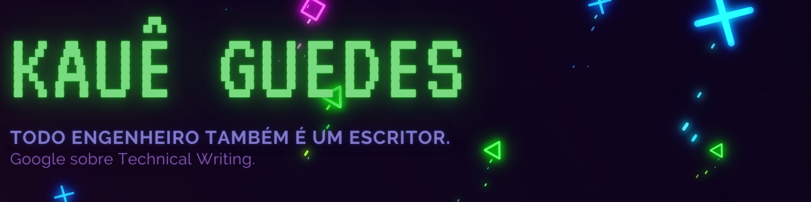

<!--
**Kaue-G/Kaue-G** is a ✨ _special_ ✨ repository because its `README.md` (this file) appears on your GitHub profile.

Here are some ideas to get you started:

- 🔭 I’m currently working on ...
- 🌱 I’m currently learning ...
- 👯 I’m looking to collaborate on ...
- 🤔 I’m looking for help with ...
- 💬 Ask me about ...
- 📫 How to reach me: ...
- 😄 Pronouns: ...
- ⚡ Fun fact: ...
-->
<h1 align="center">Hi there 👋</h1>

 

Olá, sou <b>Kauê Guedes</b>.

## Sobre mim:
Aberto a desafios, mantenho a busca diária em novos conhecimentos e formas diferentes de percepção, apaixonado por tecnologia, engenharia de Software e produção audiovisual.
### _"O primeiro passo, é acreditar!"_
_- kauê guedes -_

Icons made by <a href="https://www.freepik.com" title="Freepik">Freepik</a>
from <a href="https://www.flaticon.com/" title="Flaticon">www.flaticon.com</a>